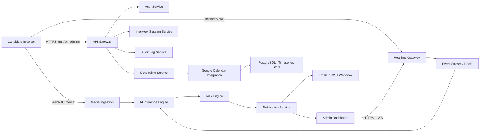

# System Architecture

## Design Goals

- Real-time alert propagation under 200 ms for suspicious events
- Strong separation between product APIs and inference workloads
- Cross-platform browser support for Windows and macOS candidates
- Privacy-aware data storage and auditable admin actions

## High-Level Architecture

## Service Boundaries

### `apps/web`

- Candidate experience
- Admin console
- Secure login and join flows
- Device checks and local telemetry capture

### `services/gateway`

- Session bootstrap APIs
- WebSocket fanout for live metrics and alerts
- Telemetry ingestion from browser clients
- Admin stream subscriptions

### `services/inference`

- Computer vision detections
- Audio event detection
- Multimodal fusion and risk scoring
- Temporal aggregation and thresholding

### `services/notifications`

- In-app alert formatting
- Email, SMS, and webhook delivery adapters

### Persistence

- PostgreSQL for users, interviews, incidents, and schedules
- Redis for presence, pub/sub, and low-latency fanout
- Object storage for optional recordings and artifacts

## Interview Monitoring Data Flow

1. Candidate joins using a signed interview link.
2. Browser performs camera, microphone, bandwidth, and permission checks.
3. Candidate client streams:
   - local media to the meeting stack
   - device/activity telemetry to the gateway
   - extracted low-bandwidth features to inference where possible
4. Inference service computes modality scores:
   - identity continuity
   - gaze deviation
   - head pose inconsistency
   - multi-person detection
   - object detection for phone and second-screen behaviors
   - voice overlap and prompt-like audio events
5. Risk engine fuses event streams into a rolling risk score.
6. High-confidence events are pushed to the admin dashboard and logged.

## Deployment Recommendation

- Frontend on Vercel or CloudFront + S3
- APIs and WebSocket gateway on AWS ECS or EKS
- Inference on GPU-backed autoscaling workers
- Redis for pub/sub and low-latency state
- PostgreSQL for transactional data
- S3 for encrypted recordings

## Performance Tactics

- Run lightweight models on the client when feasible
- Send cropped face frames or embeddings, not full HD video, when policy permits
- Use ONNX/TensorRT optimized models for server inference
- Separate critical alerts from bulk analytics paths
- Batch non-critical persistence writes

## Security Controls

- JWT-bound interview sessions
- TLS 1.3 for API and WebSocket transport
- DTLS-SRTP for media transport
- Row-level authorization for session data
- Encrypted storage for recordings and incident evidence
