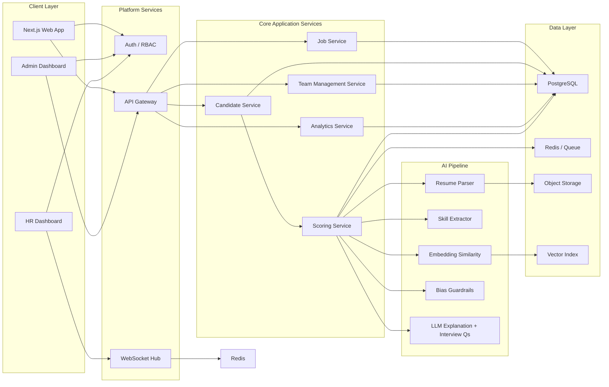
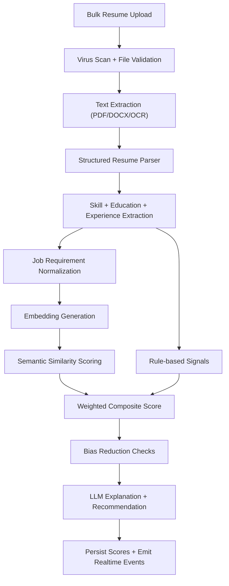

# System Design

## 1. Architecture Diagram



Note: The final `F --> Redis` edge represents pub/sub fan-out; in implementation use Redis channels or a managed realtime backbone.

## 2. Frontend UI Structure

### Auth

- `/login`
- `/register`
- `/forgot-password`

### Admin

- `/admin`
- `/admin/team`
- `/admin/activity`
- `/admin/billing`

### HR

- `/hr`
- `/hr/jobs/new`
- `/hr/jobs/[jobId]`
- `/hr/candidates`
- `/hr/candidates/[candidateId]`

### Shared UX Patterns

- Persistent sidebar with tenant switcher
- Dark/light theme toggle
- Realtime activity rail
- KPI cards with animated counters
- Job and candidate filters with saved views

## 3. Backend API Design

### Auth

- `POST /api/v1/auth/login`
- `POST /api/v1/auth/refresh`
- `GET /api/v1/auth/me`

### Organizations and Team

- `GET /api/v1/organizations/{org_id}`
- `GET /api/v1/team-members`
- `POST /api/v1/team-members`
- `PATCH /api/v1/team-members/{user_id}`
- `DELETE /api/v1/team-members/{user_id}`

### Jobs

- `GET /api/v1/jobs`
- `POST /api/v1/jobs`
- `GET /api/v1/jobs/{job_id}`
- `PATCH /api/v1/jobs/{job_id}`
- `POST /api/v1/jobs/{job_id}/publish`

### Candidates and Uploads

- `POST /api/v1/candidates/upload`
- `GET /api/v1/candidates`
- `GET /api/v1/candidates/{candidate_id}`
- `GET /api/v1/jobs/{job_id}/leaderboard`
- `POST /api/v1/candidates/{candidate_id}/reprocess`

### Analysis

- `GET /api/v1/analyses/{analysis_id}`
- `GET /api/v1/candidates/{candidate_id}/report`
- `POST /api/v1/candidates/{candidate_id}/interview-questions`
- `POST /api/v1/exports/candidates`

### Realtime

- `WS /ws/organizations/{org_id}/events`
- Topics: `candidate.processing`, `candidate.scored`, `job.updated`, `team.activity`

## 4. AI Pipeline Flow



## 5. Bias Reduction Mechanisms

- Remove protected-attribute hints before LLM evaluation where possible.
- Prefer skills, outcomes, seniority, certifications, and domain context over identity-correlated proxies.
- Store raw AI rationale and human overrides for auditability.
- Run periodic calibration tests by cohort to detect drift and score disparity.
- Allow configurable organization-level fairness rules.

## 6. Scoring Logic

```text
Final Score = skill_match * 0.40
            + experience_relevance * 0.30
            + education_fit * 0.15
            + additional_factors * 0.15
```

Recommendation bands:

- `85-100`: Shortlist
- `65-84`: Consider
- `<65`: Reject

## 7. Subscription and Multi-Tenancy

- Tenant-scoped tables with `organization_id`
- Row-level authorization checks on every query
- Usage meters for resumes processed, active jobs, and seats
- Stripe-ready billing boundary at the organization layer
- Optional dedicated storage buckets for enterprise tenants
